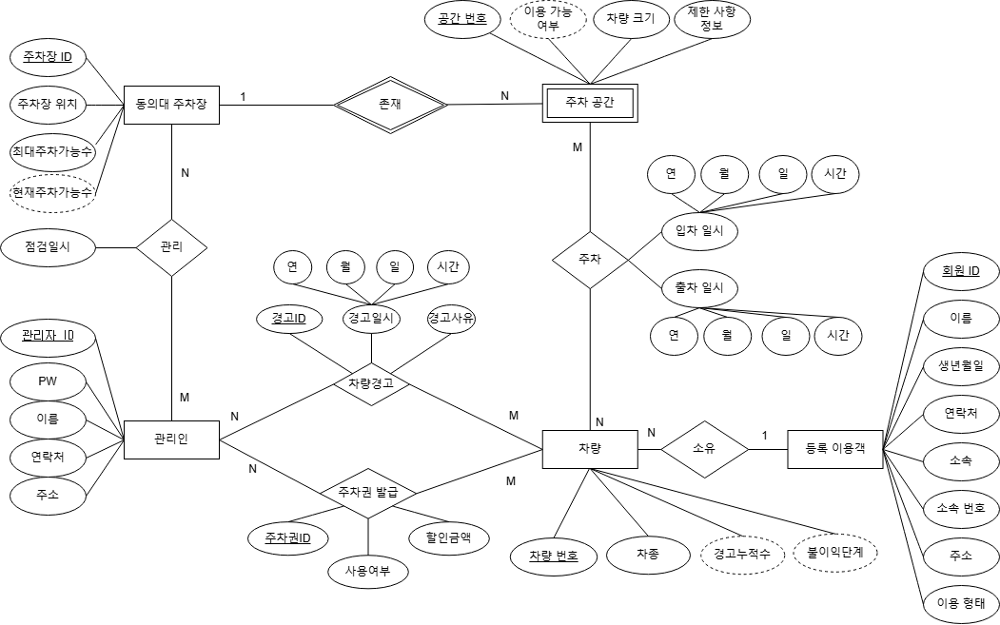
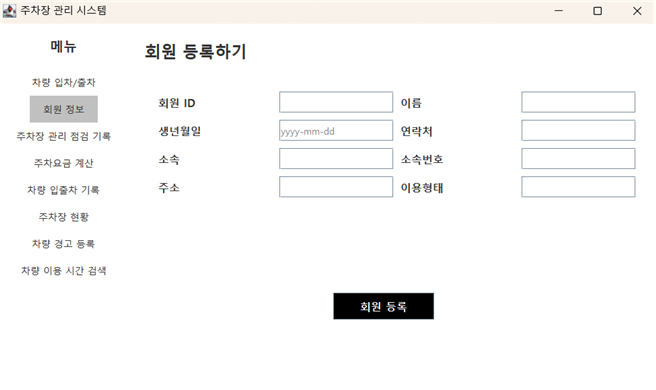
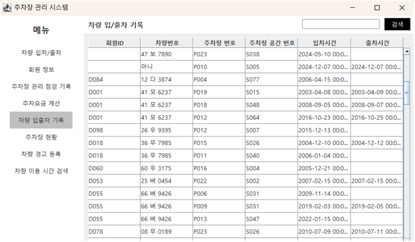

# 🚗 주차장 관리 시스템 (Parking Management System)

## 📌 프로젝트 개요

본 프로젝트는 차량의 입차/출차 및 주차 공간 관리를 효율적으로 처리하기 위한 **주차장 관리 시스템**입니다.
데이터베이스와 연동하여 실시간으로 주차 상태를 관리하고, 다양한 자동화 로직(트리거, 트랜잭션 등)을 구현하는 것을 목표로 합니다.

---

## 🎯 주요 기능

### 🚘 차량 관리

* 차량 등록 및 조회
* 입차 / 출차 처리
* 차량 상태 관리

### 🅿️ 주차 관리

* 주차 공간 배정
* 주차 기록 저장
* 주차 공간 사용 여부 관리

### 🎟️ 주차권 시스템

* 주차권 발급 및 사용 처리
* 할인 금액 적용
* 주차권 자동 차감 (트리거 활용)

### ⚠️ 경고 및 자동 처리

* 차량 경고 발생 시 주차권 차감
* 주차권 없을 경우 패널티 자동 부여

---

## 🛠️ 기술 스택

| 구분           | 기술                   |
| ------------ | -------------------- |
| Language     | Java (JDK 8)         |
| UI           | Java Swing           |
| Database     | Oracle               |
| Architecture | DAO / DTO / UI 분리 구조 |
| 기타           | 트랜잭션, 트리거            |

---

## 🗂️ 프로젝트 구조

```
📦 project
 ┣ 📂 Controller
 ┣ 📂 DB
 ┣ 📂 DTO
 ┗ 📂 UI
```

---

## 🔄 주요 트랜잭션 흐름

### 차량 입차

1. 차량 존재 여부 확인
2. 없으면 차량 등록
3. 주차 공간 확인
4. 주차 테이블에 기록

### 차량 출차

1. 주차 기록 조회
2. 주차 요금 계산
3. 출차 처리 및 데이터 삭제

---

## ⚙️ 데이터베이스 핵심 로직

### 트리거 예시

* 차량 경고 발생 시:

  * 주차권 자동 차감
  * 주차권 없으면 패널티 주차권 생성 (할인금액 -1000)

---

## 💡 주요 특징

* 트랜잭션 기반 안정적인 데이터 처리
* 트리거를 활용한 자동화 로직 구현
* UI / DB 완전 분리 구조
* 확장 가능한 설계

---


## 🗄️ 데이터베이스 구조 (ERD)

<p align="center">
  
</p>

---

## 💻 실행 화면

### 🚘 메인 화면

<p align="center">
  
</p>

### 🅿️ 주차 관리 화면

<p align="center">
  
</p>

### 🎟️ 주차권 관리 화면

<p align="center">
  
</p>


## 📄 라이선스

해당 프로젝트는 학습 및 교육 목적으로 제작되었습니다.
